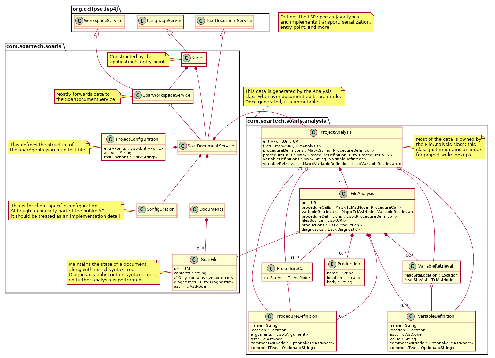
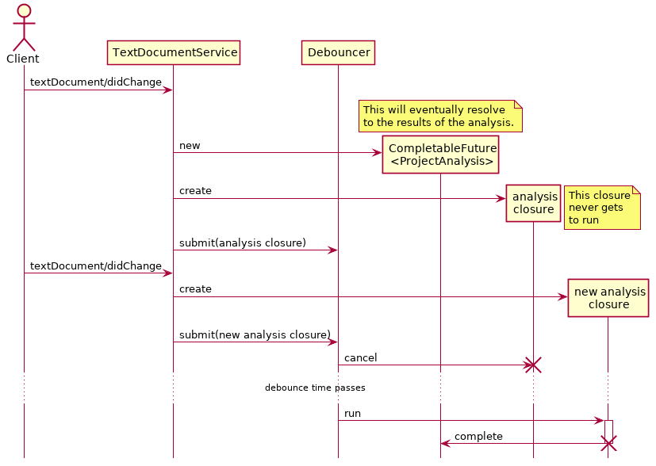

This document outlines the basic architecture of the Soar Language Server.

The language server protocol allows tools such as editors and IDEs to
communicate with language tooling using a common interface. This means
that IDE features only need to be implemented once, and they can be
made available to all editors that support the protocol:

Building tooling on top of the LSP spec is a pragmatic choice for many
languages, and particularly languages such Soar, which has a
relatively small community and limited resources to devote to tooling.

# Overview

The language server performs two main actions: it analyses source code
and it handles queries defined by the LSP API. In order to keep the
API handlers simple, fast, and responsive, we try to move as much
complexity as possible into the analysis part.

The bulk of the interesting code can be found in two places: the
`Analysis` class and the `SoarDocumentService` class.

# Analysis

Since we want queries to the server to be fast and responsive, we
analyse the codebase ahead of time, in a background thread. This
occurs in the `Analysis` class, which has a public interface
consisting of a single static method.

When we analyse a project, we create a new instance of a JSoar `Agent`
and override the `proc`, `set`, `source`, and `sp` commands (as well
as `pushd` and `popd`). Then, starting at the user-configured entry
point, we evaluate each top-level command in the file, which may
result in our implementations of the above commands being invoked
(even if they were called via some indirection or inside a Tcl
procedure). We then record all the relevant information we will need
about variable and procedure definitions and references, production
definitions, and so on. If the `source` command was invoked, then we
repeat this process recursively.

The result is that we build up the data structures in the
`com.soartech.soarls.analysis`, shown in figure below.

Since the Tcl interpreter used internally by JSoar is stateful, we
unfortunately cannot reuse the intermediate results of an analysis
without sacrificing correctness. Therefore, whenever the user makes a
change to _any_ file that was sourced as part of an agent, we have to
analyse the entire project again. To avoid extra CPU usage, we use the
`Debouncer` class to schedule analyses; we can notify the debouncer
every time the user makes an edit, but it only starts an analysis if
there have been no edits for a period of time. This period is
configurable and defaults to one second. The debouncing and scheduling
logic proceeds as shown below.

# Implementing the Language Server API

The LSP spec is defined primarily by the `TextDocumentService` and
`WorkspaceService` interfaces in the `lsp4j` library. We implement
these interfaces in the `SoarDocumentService` and
`SoarWorkspaceService` classes respectively. The workspace service
maintains little state of its own, and simply forwards information to
the document service. In retrospect it might have been reasonable to
have a single class that implements both of these interfaces.

For each request from the LSP spec that we implement, we override the
corresponding method from one of those interfaces. Since language
servers are designed to run asynchronously from their clients, all of
these methods return `CompletableFuture`s, objects that represent the
result of a computation at some later point in time. Also, since
analyses take place in a background thread, the results of an analysis
are also represented by a `CompletableFuture<ProjectAnalysis>`.
Therefore, much of our implementation of the LSP API takes place
inside the context of a future. This means that even if we cannot
provide results right away, the server will never block, but may
return a result eventually.

# Manifest file and handling entry points

Since there is no standard way to determine the entry point of a Soar
agent, we require users to create a manifest file (called
`soarAgents.json`) at the root of their workspace. This file defines
the entry point(s) of the agent. Even if two `.soar` files source the
same common code, it is possible that a variable defined differently
in each entry point could change the behaviour of the code being
sourced. Therefore, we have to perform a separate analysis for each
entry point.

The manifest file's structure is defined by the `ProjectConfiguration`
class. The file is read when the server starts up and again any time a
change is made. Unlike `.soar` and `.tcl` files, for which we
automatically get `didChange` notifications from the client, we
specifically register for a `workspace/didChangeWatchedFiles`
notification for the `soarAgents.json` file.

When a `textDocument/didChange` notification is received, we can look
at the result of the previous analyses to see if the file that changed
was sourced as part of a given agent, and therefore avoid re-running
an analysis for entry points that we know will not produce different
results.

# Testing

The test suite is composed mostly of small integration tests. Most
tests extend the `LanguageServerTestFixture` class, which implements
the `LanguageClient` interface from the `lsp4j` library. This acts as
a mock editor/client using one of the test projects found in the
`src/test/resources` directory. The tests are expressed in terms of
the LSP API, albeit using direct function calls instead of JSON.